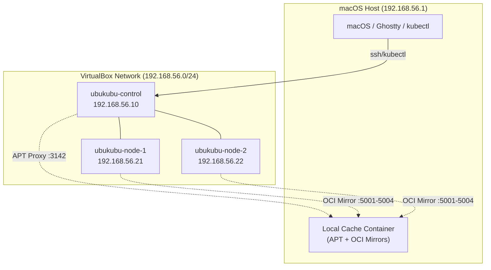
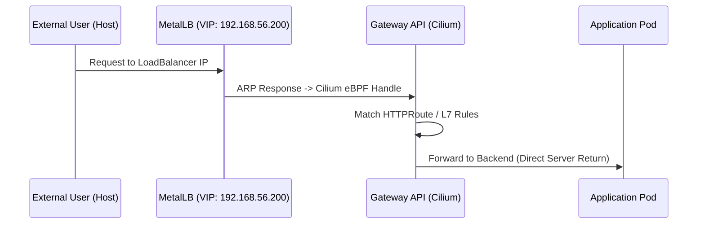
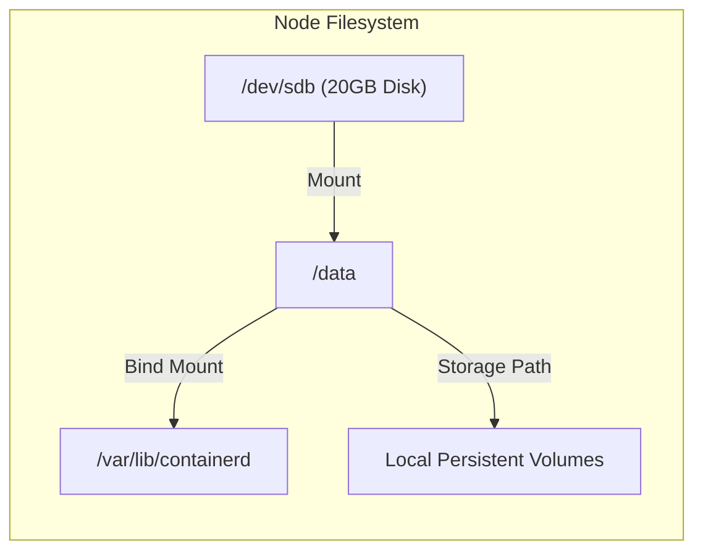
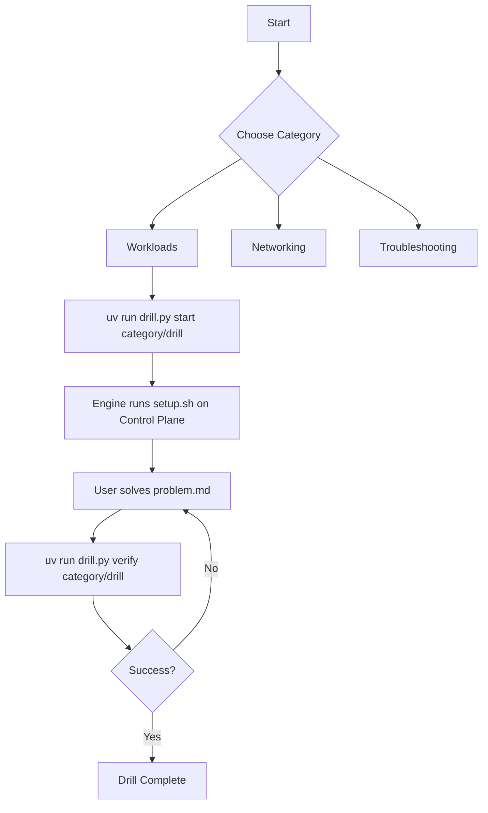

# Lab Infrastructure & Architecture: sandbox-cka

This document provides a detailed overview of the Certified Kubernetes Administrator (CKA) study environment, including its infrastructure, networking stack, storage strategy, and optimization layers.

## 1. System Overview

The sandbox is a multi-node Kubernetes cluster virtualized via **Vagrant** and **VirtualBox** on a macOS host. It is designed to be "exam-hardened," using modern cloud-native components (Cilium, Gateway API) while remaining lightweight enough for local development.

### Core Specifications
- **OS**: Ubuntu 24.04 LTS (Noble Numbat)
- **K8s Version**: v1.34.x (Bootstrapped with `kubeadm`)
- **Runtime**: `containerd` (v1.7+)
- **Nodes**: 
    - `ubukubu-control`: 4 vCPUs, 4GB RAM (IP: `192.168.56.10`)
    - `ubukubu-node-1`: 3 vCPUs, 3GB RAM (IP: `192.168.56.21`)
    - `ubukubu-node-2`: 3 vCPUs, 3GB RAM (IP: `192.168.56.22`)

---

## 2. Infrastructure Topology

The cluster uses a host-only network (`192.168.56.0/24`) for inter-node communication and a NAT interface for internet access.

---

## 3. Networking Architecture

The cluster employs a "kube-proxy-less" architecture, delegating all service routing and load balancing to **Cilium** via eBPF.

### Networking Stack
- **CNI**: Cilium v1.18+ (`kubeProxyReplacement=true`)
- **LoadBalancer**: MetalLB (L2 Mode)
- **Ingress/Gateway**: Kubernetes Gateway API (implemented by Cilium)
- **Observability**: Hubble (enabled with UI)

### Traffic Flow (External to Service)

---

## 4. Storage Strategy

To prevent root filesystem saturation and mimic production disk management, each node is equipped with a secondary **20GB Virtual Disk**.

### Disk Layout
- **Root (/)**: System binaries and logs.
- **Extra Disk (/data)**: Ext4 formatted secondary disk.
    - `/data/containerd`: Bind-mounted to `/var/lib/containerd`. All container images and writable layers live here.
    - `/data/local-path-provisioner`: The root directory for the `local-path` StorageClass.

---

## 5. Optimization: The Caching Layer

Provisioning speed is optimized using a local "Bridge" running on the host. This significantly reduces bandwidth usage and ensures idempotency during repeated `vagrant destroy && vagrant up` cycles.

- **APT Proxy**: `apt-cacher-ng` caches Ubuntu and Kubernetes `.deb` packages.
- **OCI Registry Mirrors**: Pull-through caches for:
    - `docker.io` (Port 5001)
    - `registry.k8s.io` (Port 5002)
    - `ghcr.io` (Port 5003)
    - `quay.io` (Port 5004)

---

## 6. Study Workflow (The Drill Engine)

The environment includes a custom Python-based **Drill Engine** (`drill.py`) to manage practice scenarios.

### Workflow Flowchart

---

## 7. Ergonomics & CLI Tools

The environment is pre-configured with several utilities to aid in the CKA exam:
- **Shells**: `bash` (configured with CKA aliases) and `fish` (for interactive use).
- **Aliases**: `k` for `kubectl`, `kpop` for `get pods -A`.
- **Tools**: `jq`, `yq`, `bat` (as a cat replacement with syntax highlighting), `ripgrep`, and `etcd-client`.
- **Vim**: Optimized with 2-space indentation and YAML-friendly defaults.
