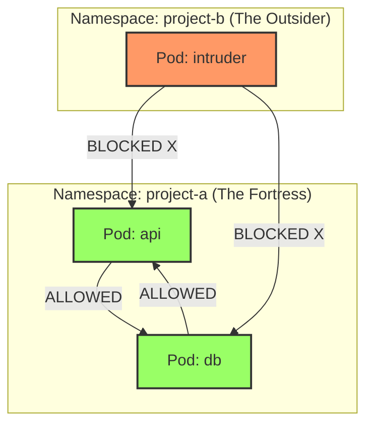

# Deep Dive: The "Namespace Isolation" Policy

**File:** `deny-all-ingress-from-other-ns.yaml`

## 1. The Executive Summary

This NetworkPolicy creates a **whitelist** that says:
> "I, the namespace `project-a`, refuse to talk to anyone... except myself."

It effectively **isolates** the namespace from the rest of the cluster, while allowing all services *within* `project-a` to communicate freely with each other.

---

## 2. Visualizing the Flow

Imagine two namespaces: `project-a` (our fortress) and `project-b` (the outsider).



---

## 3. The Evidence (`kubectl explain`)

This is your "Ammo Gun" for the exam. You don't need to memorize the behavior if you know how to ask the cluster.

Run this command:

```bash
kubectl explain networkpolicy.spec.ingress.from.podSelector
```

**The Output (The Smoking Gun):**
> "If namespaceSelector is also set, then the NetworkPolicyPeer as a whole selects the pods matching podSelector in the Namespaces selected by NamespaceSelector. **Otherwise it selects the pods matching podSelector in the policy's own namespace.**"

This single sentence proves that omitting `namespaceSelector` restricts the scope to the local namespace.

---

## 4. The Anatomy of the YAML

Let's dissect the file specifically focusing on the "Magic Selectors".

```yaml
apiVersion: networking.k8s.io/v1
kind: NetworkPolicy
metadata:
  name: deny-all-ingress-from-other-ns
  namespace: project-a  # <--- The "Home" Namespace
spec:
  # 1. THE TARGET
  # "selects" all pods in project-a. 
  # If a pod is in project-a, this policy applies to it.
  podSelector: {} 

  # 2. THE DIRECTION
  # specifically filters INCOMING traffic.
  policyTypes:
  - Ingress

  # 3. THE RULES (The Whitelist)
  ingress:
  - from:
    # 4. THE SOURCE (The "Magic" Part)
    # This looks empty, but it is powerful.
    # Because 'namespaceSelector' is missing, it implies "My Own Namespace"
    - podSelector: {}
```

---

## 5. The "Gotcha" Matrix

Here is how small changes to the YAML drastically change the behavior:

| YAML Snippet in `ingress.from` | Logic | Result |
| :--- | :--- | :--- |
| **Current File**<br>`- podSelector: {}` | Pods: ALL<br>Namespaces: SAME | **Namespace Isolation**<br>(Only internal traffic allowed) |
| **All Namespaces**<br>`- namespaceSelector: {}` | Pods: ALL<br>Namespaces: ALL | **Allow All**<br>(Traffic from anywhere allowed) |
| **Empty Pod Selector**<br>`- namespaceSelector: {}`<br>`podSelector: {}` | Pods: ALL<br>Namespaces: ALL | **Allow All**<br>(Explicitly selects all pods in all namespaces) |
| **Specific Namespace**<br>`- namespaceSelector:`<br>`matchLabels:`<br>`env: prod` | Pods: ALL<br>Namespaces: "prod" | **Allow from Prod**<br>(All pods in prod can talk to us) |

---

## 6. Official Documentation Citation

**Topic:** Behavior of `to` and `from` selectors  
**URL:** [https://kubernetes.io/docs/concepts/services-networking/network-policies/](https://kubernetes.io/docs/concepts/services-networking/network-policies/)

> **Excerpt:**
> "There are four kinds of selectors that can be specified in an ingress `from` section...
>
> 1. **podSelector**: This selects particular Pods **in the same namespace as the NetworkPolicy** which should be allowed as ingress sources..."

---

## 7. Recursive Explain (Bonus)

If you want to see the whole tree structure to see where `from` fits in:

```bash
kubectl explain networkpolicy.spec.ingress --recursive
```

Output visualization:

```
FIELDS:
   from <[]Object>
      ipBlock <Object>
         cidr <string>
         except <[]string>
      namespaceSelector <Object>
         matchExpressions <[]Object>
            key <string>
            operator <string>
            values <[]string>
         matchLabels <map[string]string>
      podSelector <Object>      <---- This is where we were looking
         matchExpressions <[]Object>
            key <string>
            operator <string>
            values <[]string>
         matchLabels <map[string]string>
   ports <[]Object>
      endPort <integer>
      port <string>
      protocol <string>
```
